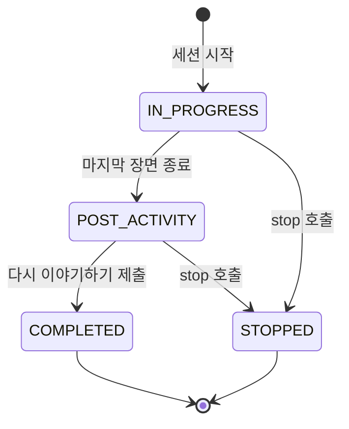
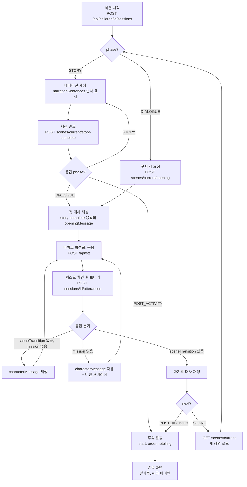
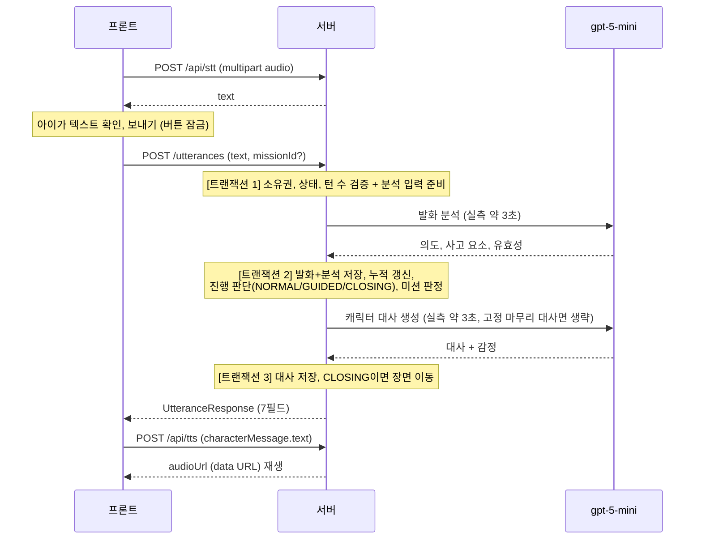

# 이야기 전개 가이드

이야기 시작부터 완료까지, 프론트엔드와 백엔드의 전 과정을 정리한 문서다.
언제 어떤 API를 어떤 값으로 부르는지, 어떤 조건을 체크하는지, 언제 멈추고 언제 다시
시작하는지, 미션과 후속 활동이 있을 때와 없을 때 무엇이 달라지는지를 담는다.

- 1장: 도식과 흐름 요약. 전체 그림을 먼저 잡는다
- 2장: 용어 사전. 세션, 장면, 턴, phase, 모드가 각각 무엇인지
- 3장: 프론트엔드 전 과정. 이 순서대로 구현하면 된다
- 4장: 백엔드 전 과정. 같은 구간에서 서버 내부에 일어나는 일
- 5장: 분기 시나리오. 미션 유무, 후속 활동 유무, 중단과 재개, 종료 사유별 차이
- 6장: 에러와 복구 전체 표
- 7장: 개발 순서 체크리스트
- 8장: 이미지 에셋 경로 표
- 9장: 보호자 리포트 인계 (완료 이후)
- 10장: 콘텐츠 문서와 시드의 차이 (확정 반영 내역과 문구 차이 기록)
- 부록: 관련 문서와 기획 원본

요청/응답 필드의 전수 명세는 [API_및_DTO_명세.md](API_및_DTO_명세.md)가 원본이다.
이 문서는 흐름과 조건을 다루고, 본문에 나오는 필드는 실제 코드와 대조를 마친 것이다.

---

# 1. 한눈에 보기

## 1.1 세션 상태와 화면(phase)

세션(`StorySession`)의 저장 상태는 4개, 화면을 고르는 phase는 그 상태에서 파생된다.



| status | phase 계산 | 화면 |
|---|---|---|
| IN_PROGRESS + 현재 장면이 STORY | `STORY` | 내레이션 |
| IN_PROGRESS + 현재 장면이 DIALOGUE | `DIALOGUE` | 대화 |
| POST_ACTIVITY | `POST_ACTIVITY` | 후속 활동 |
| COMPLETED, STOPPED | `ENDED` | 완료/종료 |

**phase는 서버가 계산해 내려주는 파생값이다.** 프론트는 응답의 phase로만 화면을 고르고,
장면 번호를 세거나 상태를 추측하지 않는다.

주의: **stop은 되돌릴 수 없다.** STOPPED 세션을 다시 IN_PROGRESS로 되돌리는 API는 없고,
홈의 이어하기 목록에도 IN_PROGRESS 세션만 뜬다. stop은 "이 이야기를 그만두겠다"는 명시적
행동에만 쓰고, 앱 이탈이나 백그라운드 전환에는 부르지 않는다(그래야 이어하기가 산다).

위 다이어그램은 **의도된 전이**다. 서버의 stop에는 상태 가드가 없어서 COMPLETED 세션에
stop을 부르면 완료 기록이 STOPPED로 덮인다. 완료 화면 이후에는 stop을 부르지 않는다.

## 1.2 전체 흐름 한 장



## 1.3 발화 턴 하나의 시퀀스



턴 하나의 서버 처리는 LLM 2회 순차 호출로 **실측 약 6초, 최악 20초**다.
전송 중 보내기 버튼을 잠그고, 프론트 HTTP 타임아웃은 25초 이상으로 잡는다.

## 1.4 방귀 뀌는 며느리 장면 지도

시드 기준 참고용이다. **코드에서 장면 번호로 분기하지 않는다.** phase와 sceneType으로만
분기해야 콘텐츠가 바뀌어도 깨지지 않는다.

| 순서 | 유형 | 캐릭터 | 최소/최대 턴 | 필수 요소 | 미션 |
|---|---|---|---|---|---|
| 1 도입 | STORY | - | - | - | - |
| 2 전개1 | STORY | - | - | - | - |
| 3 대화1 | DIALOGUE | 방귀쟁이 며느리 | 2/4 | PERSPECTIVE, EMOTION, REASON, SOLUTION | 없음 |
| 4 전개2 | STORY | - | - | - | - |
| 5 대화2 | DIALOGUE | 시아버지 | 2/5 | PERSPECTIVE, EMPATHY, REASON, REQUEST | 없음 |
| 6 전개3 | STORY | - | - | - | - |
| 7 대화3 | DIALOGUE | 마을 이장 | 2/5 | SOLUTION, REASON, REQUEST, RESULT | 미션1 (문제 해결) |
| 8 전개4 | STORY | - | - | - | - |
| 9 대화4 | DIALOGUE | 방귀쟁이 며느리 | 2/4 | EMOTION, PERSPECTIVE, RESULT, SOLUTION | 미션2 (관점 전환) |

이후 후속 활동(카드 5장 순서 맞추기, 핵심 단어 4개, 다시 이야기하기)을 거쳐 완료된다.

---

# 2. 용어 사전

| 용어 | 뜻 |
|---|---|
| 세션 | 아이 한 명이 이야기 한 편을 플레이하는 단위. `sessionId`로 식별 |
| 장면(scene) | 이야기의 한 단계. STORY(내레이션)와 DIALOGUE(대화) 두 유형 |
| 턴 | 대화 장면에서 아이 발화 1건과 캐릭터 응답 1건의 묶음 |
| phase | 지금 어떤 화면을 그려야 하는지. STORY / DIALOGUE / POST_ACTIVITY / ENDED |
| 모드(mode) | 서버가 정한 이번 턴의 진행 방식. NORMAL(일반) / GUIDED(강한 유도) / CLOSING(장면 종료) |
| 사고 요소 | 발화에서 확인하는 8종: DECISION, REASON, PERSPECTIVE, SOLUTION, RESULT, EMOTION, EMPATHY, REQUEST |
| 필수 요소 | 장면이 목표로 하는 사고 요소 묶음. 여러 발화에 걸쳐 누적 충족 |
| 발화 유효성 | 발화의 정보량 판정 5종: VALID / SHORT / UNCLEAR / OFF_TOPIC / PLAYFUL |
| 약한 유도(soft-cue) | 모드는 NORMAL인데 캐릭터가 남은 걱정을 가볍게 흘리는 것. 응답에서는 mode=NORMAL + guidanceTarget에 값이 있는 형태 |
| 미션 | 대화 장면에 걸린 활동. 문제 해결형(질문 4개)과 관점 전환형(카드 4장) |
| 후속 활동 | 이야기 완주 후의 말하기 활동. 카드 순서 맞추기와 다시 이야기하기 |
| 별가루 | 보상 재화. 완주와 장면 보너스로 지급 |

---

# 3. 프론트엔드 전 과정

이 장의 절 순서가 곧 구현 순서다. 각 절은 "호출 -> 사용 값 -> 체크 조건 -> 다음 행동"
구조로 적는다.

## 3.0 공통 규칙 (모든 절에 적용)

1. **화면 분기는 phase로만 한다.** 응답에 phase가 있으면 항상 그 값을 따른다
2. **판단은 서버 몫이다.** 목표 달성, 유도, 미션 노출, 장면 종료를 프론트가 계산하지 않는다
3. **TTS 계약**: 캐릭터 메시지의 `audioUrl`이 null이면 `POST /api/tts`로 합성한다.
   현재는 모든 경로에서 항상 null이므로 사실상 매번 호출한다. 단 null 검사는 유지한다 -
   서버가 나중에 채워 보내면 호출을 생략해야 한다
4. **캐릭터 표정/태도 연출은 `analysis` 값으로만 한다**(마음-01). 발화 내용을 프론트가
   자체 해석하지 않는다
5. 모든 API는 JWT 인증이 필요하고, 남의 리소스면 403, 없으면 404가 온다.
   단 이미지 에셋(`/stories/**`)은 인증 없이 열린다

**화면 구성 원칙** (콘텐츠 문서의 화면 흐름과 고객 인터뷰 UX 참고사항 기준):

- 화면은 5개다: 도입(전체 화면) + 장면 화면 4개(왼쪽 전개 내레이션, 오른쪽 대화의
  **좌우 분할**). 즉 전개2(STORY)와 대화2(DIALOGUE)는 별개 페이지가 아니라 한 화면의
  왼쪽과 오른쪽이다. API 흐름은 이 문서 그대로이고(전개가 끝나면 story-complete),
  화면만 분할 배치다
- **전개와 대화는 동시에 진행하지 않는다.** 전개 재생 중 대화 영역은 비활성(대기)이고,
  전개가 끝나면 대화 영역을 활성화해 첫 대사를 재생한다. 전개 종료 후 왼쪽은 전개
  이미지나 마지막 장면을 유지한다
- 긴 텍스트를 한 번에 보여주지 않는다. 내레이션은 한 문장씩 순차 제시한다
- 캐릭터 음성은 자동 재생하고, 다시 듣기 버튼을 함께 둔다(수동 재생 강제 금지)
- **현재 진행 상태를 항상 구분해 보여준다**: 아이 발화 중 / 음성 변환 중 /
  캐릭터 응답 대기(서버 처리 약 6초 구간). 캐릭터 말이 끝나 아이 차례가 되는 순간은
  효과음과 화면 변화로 명확히 알린다
- 화면에는 현재 단계에서 필요한 행동만 보이게 한다. 버튼과 기능을 동시에 여러 개
  노출하면 저학년 아동이 조작을 놓친다

## 3.1 세션 시작

storyId는 이야기 선택 화면에서 얻는다: 목록 `GET /api/stories`(주제 필터 `?topic=`),
상세 `GET /api/stories/{storyId}`.

```
POST /api/children/{childId}/sessions
body: { "storyId": "<이야기 목록에서 고른 UUID>" }
-> 201 { sessionId, status, currentScene, phase }
```

- **사용 값**: `sessionId`를 저장한다(이후 모든 호출의 경로 변수).
  `currentScene`으로 첫 화면을 바로 그린다(별도 조회 불필요)
- **체크 조건**: `phase`로 분기. 방귀 이야기는 도입이 STORY라 `STORY`로 시작한다.
  첫 장면이 DIALOGUE인 이야기면 `DIALOGUE`가 오는데, **이 응답에 첫 대사는 없다** -
  opening 호출(3.3절)로 가져온다
- **에러**:
  - 409 `CONSENT_REQUIRED`: 아동 동의가 없거나 철회됨. 동의 화면으로 안내
  - 404 `NOT_FOUND`: 이야기가 없거나 미발행(둘 다 같은 응답이다)

## 3.2 STORY 장면 (내레이션)

**그리기**: `currentScene.narrationSentences`(문장 배열)를 한 문장씩 순차 표시한다.
`imageUrl`로 배경을 그린다. 음성이 필요하면 문장별로 `POST /api/tts { text }`를
호출한다(characterName 없이 -> 내레이션 보이스). 이 화면에서는 마이크를 비활성화한다.

**재생이 끝나면** (끝났는지는 프론트만 안다):

```
POST /api/sessions/{sessionId}/scenes/current/story-complete
-> 200 { phase, currentScene, openingMessage }
```

- **체크 조건**: 응답 `phase`로 3분기
  - `STORY`: 다음도 내레이션. `currentScene`으로 이 절을 반복
  - `DIALOGUE`: 대화 장면 진입. **`openingMessage`(고정 첫 대사)가 이 응답에 같이 온다.**
    별도 호출 없이 바로 재생하면 된다(이름 치환 완료 상태)
  - `POST_ACTIVITY`: 마지막 장면이 STORY로 끝난 이야기. `currentScene`은 null이고
    후속 활동으로 간다
- **주의**: 이 API는 **멱등이 아니다.** 두 번 부르면 장면이 두 번 전진한다.
  더블 탭을 막고, 응답을 받기 전 재호출하지 않는다
- **에러**: 409 `SCENE_NOT_STORY`(대화 장면에서 호출 - 화면 상태 버그),
  409 `SESSION_NOT_IN_PROGRESS`(끝난 세션)

## 3.3 DIALOGUE 진입과 첫 대사

첫 대사는 상황에 따라 두 경로로 받는다.

1. **STORY 다음에 오는 대화 장면**: `story-complete` 응답의 `openingMessage` (3.2절).
   추가 호출 없음
2. **opening 호출이 필요한 경우**: 아래 두 상황
   - 첫 장면이 DIALOGUE인 이야기의 세션 시작 직후 (시작 응답에 첫 대사가 없다)
   - 새로고침 등으로 첫 대사를 잃었을 때 (복구)

```
POST /api/sessions/{sessionId}/scenes/current/opening
-> 200 { message, alreadyOpened }
```

opening은 **멱등이다.** 몇 번을 불러도 같은 첫 대사가 오고 중복 저장되지 않는다.
`alreadyOpened=true`는 "서버에 이미 저장돼 있었다"는 뜻이지 재생 여부가 아니다.
정상 흐름에서는 항상 true가 온다.

첫 대사 재생: `message.text`를 표시하고 `POST /api/tts { text, characterName }`으로
합성해 재생한다. `characterName`은 `currentScene.characterName` 값을 그대로 쓴다
(시드 기준 "방귀쟁이 며느리", "시아버지", "마을 이장").

재생이 끝나면 효과음과 화면 변화로 아이 차례를 알리고 마이크를 활성화한다.

## 3.4 발화 턴 루프

대화 장면의 심장이다. 한 턴의 프론트 절차:

**1) 녹음 -> STT**

```
POST /api/stt
multipart/form-data, 파트명 "audio" (한도 10MB, 30초 WAV 여유 있음)
-> 200 { text, confidence, lowConfidence }
```

- 422 `STT_EMPTY_TEXT`: 무음이거나 인식 실패. 메시지가 생성되지 않았으니
  "다시 말해 볼까?" 안내 후 재녹음. 이때 재시도 횟수를 세어 둔다(sttRetryCount)
- `lowConfidence: true`: 인식은 됐지만 미덥지 않다(신뢰도 0.5 미만, 서버 판정).
  "잘 못 알아들었을 수 있어요. 다시 말해 볼까?" 안내를 띄우되 차단하지 않는다 -
  텍스트가 맞다면 아이는 그대로 보내도 된다. 다시 말하면 sttRetryCount +1

**2) 텍스트 표시 -> 아이 확인 -> 보내기**

```
POST /api/sessions/{sessionId}/utterances
header: Idempotency-Key: <UUID>     // 권장. 발화마다 새로 만들고 재시도 사이에만 유지
body: {
  "text": "<확정 텍스트>",          // 필수
  "sttRawText": "<STT 원문>",       // 선택. 최초 변환 텍스트
  "sttConfidence": 0.87,            // 선택. /api/stt 응답의 confidence를 그대로 되올린다
  "sttRetryCount": 1,               // 선택. 다시 말한 횟수 (재녹음마다 +1)
  "missionId": "mission_1"          // 미션 수행 발화일 때만 (3.5절)
}
```

**보내는 순간 버튼을 잠근다.** 처리에 약 6초, 최악 20초가 걸린다.
로딩 연출(캐릭터가 생각하는 모습 등)을 두면 체감이 낫다.

**3) 응답 분기** - 7필드 단일 스키마, null 여부로 3분기한다

```
{ childMessage, analysis, progress, characterMessage, mission, sceneTransition, safety }
```

| 검사 순서 | 조건 | 의미 | 프론트 동작 |
|---|---|---|---|
| 1 | `sceneTransition != null` | 장면 종료 | `closingReaction`이 있으면 먼저 재생 후 `characterMessage`(마지막 대사) 재생 -> 3.6절 |
| 2 | `mission != null` | 미션 노출 | `characterMessage` 재생 + 미션 오버레이 -> 3.5절 |
| 3 | 둘 다 null | 대화 계속 | `characterMessage` 재생 -> 이 절 반복 |

`mission`과 `sceneTransition`은 동시에 값이 있을 수 없다(서버가 보장).

부가 정보 활용:
- `analysis.childIntent` / `analysis.detectedElements`: 캐릭터 표정과 태도 연출 트리거
- `progress.turnCount` / `progress.maxTurns`: 남은 대화 기회 표시
- `progress.mode`: NORMAL / GUIDED / CLOSING. GUIDED 턴이나 soft-cue 턴
  (NORMAL + `guidanceTarget` 있음)에 별도 연출을 얹을 수 있다
- `childMessage.sttLowConfidence`: 저장된 발화의 저신뢰 표시(기준값 0.5, 서버 판정).
  실시간 안내는 /api/stt 응답의 `lowConfidence`가 담당하고, 이 값은 기록 조회
  화면에서 "인식이 부정확했을 수 있음"을 표시하는 용도다
- `safety`: 현재 항상 null. 값이 생기면 `characterMessage`는 생성 대사가 아니라
  안전 문구라는 뜻이다(추후 공지)

**4) 캐릭터 대사 재생**: `characterMessage.audioUrl`이 null이므로
`POST /api/tts { text, characterName }` 호출 후 재생. 재생이 끝나면 마이크 재활성화.

**에러 처리**는 6장 표를 따른다.

**재시도의 정석은 멱등키다(2026-08 확정).** 발화를 보낼 때 `Idempotency-Key` 헤더에
UUID를 실었다면, 응답을 못 받았을 때(타임아웃, 500) **같은 키로 그대로 재전송하면
끝이다** - 서버가 처리를 이미 마쳤으면 저장된 응답이 그대로 재생되고, 아직 처리
중이면 409 `REQUEST_IN_PROGRESS`가 오니 잠시 후 같은 키로 다시 보낸다. 아이가 새로
말한 발화에는 반드시 새 키를 만든다.

키를 쓰지 않는 경우에만 아래의 turn-state 판정이 필요하다:

```
GET /api/sessions/{sessionId}/turn-state
-> 200 { progress: { mode, accumulatedElements, missingElements,
                     turnCount, maxTurns, guidanceTarget }, phase }
```

직전에 알고 있던 턴 수, phase와 비교해 판정한다:

| 관찰 | 의미 | 동작 |
|---|---|---|
| turnCount 그대로, phase 그대로 | 내 발화 미반영 | 재전송 |
| turnCount +1 | 반영됨 (대화 계속) | 재전송 금지. resume으로 캐릭터 대사 복원 |
| turnCount가 0으로 리셋 또는 phase 변화 | 그 턴으로 장면이 전환됨 | 재전송 금지. resume으로 새 장면 복원 |

세 번째 경우가 함정이다. 잃어버린 응답이 장면 종료 턴이었으면 서버가 이미 다음
장면으로 옮겨 턴 수가 0이 되므로, "그대로면 미반영" 규칙만 알고 있으면 오판한다.

## 3.5 미션 오버레이

**노출**: 발화 응답의 `mission != null`인 턴에만 띄운다. 언제 띄울지는 서버가 정한다.

```
mission: {
  missionId,                      // "mission_1" 같은 문자열. 제출 시 그대로 사용
  missionType,                    // PROBLEM_SOLVING 또는 PERSPECTIVE_SHIFT
  title, description,
  payload: {
    questions: [{key, label}] 또는 null,   // 문제 해결형: tool, reason, request, expectedResult 4개
    cards: [{key, label, imageUrl, template}] 또는 null   // 관점 전환형: 카드 4장
  }
}
```

`missionType`에 따라 화면이 갈린다. `payload`는 유형에 맞는 한쪽만 값이 있다.

**수행 결과 제출**: 별도 API가 아니다. **아이가 미션에 대해 말한 발화를 다음
`utterances`에 `missionId`를 실어 보낸다.** 서버가 미션 완료로 표시하고 발화 자체는
같은 파이프라인으로 분석한다. 채점은 없다 - 미션 확인 항목이 장면 필수 요소와
대응하므로 요소 확인으로 갈음된다.

- `POST /missions/{missionId}/result` API는 **501 미구현**이다. 쓰지 않는다
- 미노출 상태에서 `missionId`를 보내면 409 `MISSION_NOT_EXPOSED`
- 다른 장면의 미션 id면 404

**오버레이 해제 시점**: `missionId`를 실은 발화의 응답을 받으면 닫는다(그 시점에
서버는 미션을 완료로 표시했다). 서버가 닫으라는 신호를 따로 주지 않으므로 해제는
프론트 판단이다.

**복구**: 새로고침으로 오버레이를 잃었으면

```
GET /api/sessions/{sessionId}/missions/current
-> 200 { mission }    // 미노출이면 mission: null (404가 아니다)
```

주의: 이 조회와 resume의 `exposedMission`은 **완료 여부를 구분하지 않는다.**
미션 수행 발화를 이미 보냈어도 장면이 닫히기 전까지는 계속 미션을 돌려주고,
응답에 완료 필드도 없다. 따라서 "이미 제출했는지"는 프론트가 로컬 상태로 기억해야
하며, 복원 시 로컬 제출 기록이 있으면 오버레이를 다시 띄우지 않는다.

**미션이 없는 장면**(대화1, 대화2)에서는 응답의 `mission`이 항상 null이다.
프론트에 별도 분기는 필요 없다 - null이면 안 띄우면 된다.

## 3.6 장면 전환

`sceneTransition`을 받은 턴의 절차:

```
sceneTransition: { next, nextSceneId, nextSceneOrder, nextSceneType, closingReason,
                   resultImageUrl }
```

1. `closingReaction`이 있으면(최대 턴 종료) 먼저 재생한다 - 아이의 마지막 말에 대한
   캐릭터의 짧은 반응이다. 이어서 `characterMessage`(고정 마지막 대사)를 재생한다.
   평가가 아니라 다음 전개로 잇는 이야기 연결 대사다
2. `closingReason`(GOAL_MET / MAX_TURNS)으로 연출을 다르게 할 수 있지만,
   **아이에게 성공/실패나 평가처럼 보여주지 않는다.** MAX_TURNS도 이야기는 자연스럽게
   이어진다
3. **결과 연출**(2026-08 확정): `resultImageUrl`이 있으면 마지막 대사 재생 뒤 그 이미지를
   연출로 끼워 넣은 다음 전환한다. 대화3(이장)의 "배가 떨어지는" 연출이 여기로 내려온다 -
   어느 장면인지 프론트가 판단할 필요 없이 값의 유무만 보면 된다. 종료 사유와 무관하게
   장면이 닫히면 항상 온다
4. `next`로 분기:
   - `SCENE`: `GET /api/sessions/{sessionId}/scenes/current`로 새 장면 콘텐츠를 받아
     그린다(서버는 이미 다음 장면으로 옮겨 둔 상태다). `nextSceneType`이 STORY면
     3.2절로, DIALOGUE면 3.3절 복구 흐름(opening)으로 첫 대사를 받는다
   - `POST_ACTIVITY`: 3.7절로. 이때 nextSceneId/Order/Type은 모두 null이다
   - `COMPLETED`: 후속 활동 config가 없는 이야기다(2026-08 확정). 세션이 이미 완료됐고
     완주 별가루도 지급됐다. 후속 활동 없이 완료 화면으로 간다

참고: 전환 턴 응답의 `progress`는 **방금 끝난 장면 기준**이다. 새 장면의 진행 상태
(턴 0, 누적 없음)는 전환 후 `turn-state`나 다음 턴 응답에서 확인된다.

## 3.7 후속 활동

세 단계를 순서대로 진행한다. 전부 `/api/sessions/{sessionId}/post-activity` 아래다.

**1) 시작 - 카드 받기**

```
POST .../post-activity/start
-> 200 { cards: [{cardId, text}], attemptCount }
```

카드는 섞인 순서로 오고, **같은 세션에서는 재호출해도 항상 같은 순서다**(시드 고정).
정답 순서는 어떤 응답에도 없다.

**2) 순서 제출 - 정답까지 반복**

```
POST .../post-activity/order
body: { "submittedOrder": ["card_3", "card_1", ...] }   // cardId 전체를 순서대로
-> 200 { correct, retellingKeywords }
```

- `correct=false`: `retellingKeywords`는 null. 재시도 안내(횟수 제한 없음)
- `correct=true`: `retellingKeywords`(핵심 단어 3~4개)를 화면에 제시

**3) 다시 이야기하기 - 완료**

핵심 단어를 참고해 아이가 이야기를 음성으로 재구성한다. `POST /api/stt`로 텍스트를
얻고 확인 후 제출한다.

```
POST .../post-activity/retelling
body: { "text": "<재구성 발화>", "sttRawText": "..." }
-> 200 { sessionStatus: "COMPLETED", completedAt,
         stardust: { earned, breakdown, balance },
         unlockedItems: [{itemId, name, thumbnailUrl}] }
```

이 호출 하나로 **세션 완료 + 별가루 지급 + 아이템 해금 계산**이 끝난다.
응답으로 완료 화면(획득 별가루, 새로 열린 아이템)을 그린다.
완료 후 흐름은 완료 화면 -> 내 행성 -> 보호자 인계(리포트) 순서다.

- 409 `RETELLING_BEFORE_ORDER`: 카드 순서를 맞히기 전. 2)로 돌려보낸다

**복구**: 어느 단계였는지 잃었으면

```
GET .../post-activity
-> 200 { status, cards, attemptCount, isOrderCorrect, retellingKeywords, retellingText, completedAt }
```

`status`가 단계를 알려준다: `NOT_STARTED` / `ORDER_PENDING`(제출 전 또는 오답) /
`ORDER_CORRECT`(단어 제시 단계) / `COMPLETED`. 이 조회만은 세션이 끝난 뒤에도
가능해서 완료 화면 복구에 쓴다.

## 3.8 중단

사용자가 명시적으로 "그만하기"를 눌렀을 때만:

```
POST /api/sessions/{sessionId}/stop   -> 200 (본문 없음)
```

- **되돌릴 수 없다.** 이어하기 목록에서도 사라진다. 확인 다이얼로그를 거치는 걸 권한다
- 앱 이탈, 백그라운드 전환, 화면 닫기에는 **부르지 않는다.** 세션을 그대로 두면
  IN_PROGRESS로 남아 언제든 이어할 수 있다
- 프런트에서 이걸 부르는 곳은 **멈춤 화면의 "처음부터 다시하기"** 하나다. 확인을 한 번
  거친 뒤 지금 세션을 끝내고, 같은 이야기로 새 세션을 만들어 그 화면으로 간다
  (`play_view.dart`). 멈춤 화면의 "이야기 나가기"는 부르지 않는다

## 3.9 재개 (이어하기)

**진입점**: 홈 API가 진행 중(IN_PROGRESS) 세션 중 가장 최근 것을 이어하기 카드로 준다.

```
GET /api/children/{childId}/home
-> 200 { inProgressSession, recommendedStories, planetWidget }
   inProgressSession: { sessionId, storyId, storyTitle, storyImageUrl,
                        status, currentSceneOrder, totalScenes, lastActivityAt }
                      또는 null (진행 중 세션 없음)
```

이어하기 카드를 탭하면 `inProgressSession.sessionId`로 아래 resume을 부른다.
주의: POST_ACTIVITY 상태 세션은 홈 이어하기 카드에 뜨지 않는다(서버가 IN_PROGRESS만
고른다). 후속 활동 중 이탈한 세션으로 돌아가려면 sessionId를 로컬에 보관해 두어야 한다.

**복원**:

```
GET /api/sessions/{sessionId}/resume
-> 200 { session, currentScene, messages, lastCharacterMessage, exposedMission }
```

한 번의 호출로 받는 것: 세션 상태와 phase, 진행 상태(progress), 현재 장면 콘텐츠 전체,
세션 전체 대화 기록(turnOrder 오름차순), 마지막 캐릭터 대사, 노출 중이던 미션.

`session.phase`로 복귀 화면을 고른다:

| phase | 복귀 방법 |
|---|---|
| STORY | `currentScene.narrationSentences`를 **처음부터** 재생 (재생 위치는 서버가 저장하지 않는다) |
| DIALOGUE | 대화 화면. `messages`로 말풍선 복원, `lastCharacterMessage`를 다시 들려주고 마이크 활성화. `exposedMission`이 있으면 오버레이도 복원 |
| POST_ACTIVITY | `GET .../post-activity`로 단계 확인 후 해당 단계로 |
| ENDED | 완료/종료 화면 |

복원되지 않는 것: STORY 재생 위치(처음부터), 음성(전부 TTS 재합성),
이전 장면에서 노출됐던 미션(장면이 넘어가면 리셋된다).

---

# 4. 백엔드 전 과정

프론트의 각 호출 뒤에서 서버가 무엇을 하는지다. 구현 수정이나 디버깅 시 여기부터 본다.

## 4.1 세션 시작 (`POST /children/{childId}/sessions`)

검증 순서: 1) 아이 소유권(내 아이인가) 2) 유효한 동의 존재(철회 안 된 동의 레코드)
3) 이야기 존재 + PUBLISHED 상태 4) 첫 장면 존재.

통과하면 세션을 IN_PROGRESS로 만들고 currentScene을 첫 장면으로 둔다.
**첫 장면이 DIALOGUE면 이 트랜잭션 안에서 고정 첫 대사를 messages에 저장까지 한다**
(응답에는 안 싣고, 프론트가 opening으로 가져간다). STORY면 저장할 것이 없다.

## 4.2 STORY 전환 (`story-complete`)

검증: 소유권 -> IN_PROGRESS -> 현재 장면이 STORY(대화 장면이면 SCENE_NOT_STORY).

다음 장면이 있으면 `moveToScene`으로 이동한다. 이때 **장면 단위 누적 상태가 전부
초기화된다**: 턴 수, 누적/최근 요소, 무진전과 저정보 카운트, 장면 목표와 종료 사유,
유도 사용 여부, 미션 노출/완료 플래그. 다음이 DIALOGUE면 첫 대사도 저장한다.

다음 장면이 없으면(STORY로 끝나는 이야기) status를 POST_ACTIVITY로 바꾼다.
이 경우 currentScene 포인터는 마지막 장면에 남는다 - 이후 조회 응답에 장면 정보가
여전히 나오지만 phase가 POST_ACTIVITY이므로 프론트는 phase를 따르면 된다.

## 4.3 발화 턴 파이프라인 (`POST /utterances`)

트랜잭션 3개와 LLM 호출 2개가 번갈아 이어진다. **외부 호출은 트랜잭션 밖이다** -
LLM 응답을 기다리는 동안 DB 커넥션을 쥐지 않기 위해서다(측정과 배경:
[트러블슈팅_턴_처리_커넥션_점유.md](트러블슈팅_턴_처리_커넥션_점유.md)).

```
[트랜잭션 1: 준비, 읽기 전용]
  소유권 확인 -> 진입 검증 3종 -> 분석 입력 준비(장면 맥락, 직전 캐릭터 대사)
      진입 검증: IN_PROGRESS인가(409 SESSION_NOT_IN_PROGRESS)
                 -> DIALOGUE 장면인가(409 SCENE_NOT_DIALOGUE)
                 -> 턴 수 < max_turns인가(409 MAX_TURNS_EXCEEDED)

  분석 LLM 호출 (트랜잭션 밖, 약 3초)
      입력: 장면 상황+갈등, 학습 목표, 직전 캐릭터 대사, 아이 발화,
            필수 요소, 요소별 인정 기준
      출력: 의도(13종), 핵심 뜻, 탐지 요소[{종류, 원문 근거}], 유효성(5종)

[트랜잭션 2: 아이 턴 반영] - 커밋되면 턴은 되돌릴 수 없다
  1) 진입 검증 재실행 (LLM 대기 사이 상태가 바뀌었을 수 있다)
  2) 아이 발화 저장 (text, sttRawText, sttConfidence, sttRetryCount)
  3) missionId가 있으면 미션 완료 표시 (4.6절)
  4) 후처리를 통과한 분석 저장 (4.4절의 후처리)
  5) 누적 갱신: 턴 수 +1, 신규 요소 병합, 무진전/저정보 카운트
  6) 진행 판단 (4.4절) + 미션 보류 보정 (4.6절)
  7) 판단 결과 기록 (직전 모드, 유도 대상)
  8) 미션 노출 판정 (4.6절)
  9) 진행 상태 스냅샷 (장면이 닫히면 상태가 지워지므로 여기서 확보)
  10) 반응 원칙(reactionKey) 계산과 캐릭터 프롬프트 조립 (4.5절)

  캐릭터 LLM 호출 (트랜잭션 밖, 약 3초)
      고정 마무리 대사가 있는 CLOSING 턴은 호출 생략 (단 최대 턴 종료는
      짧은 반응 생성을 위해 1회 호출)

[트랜잭션 3: 캐릭터 응답 반영]
  CLOSING이면: 장면 종료 처리 (4.7절)
  아니면: 캐릭터 대사 저장(이름 치환) 후 응답 조립
```

동시 발화(연타) 방어는 두 겹이다: 세션의 낙관적 락과 messages의
(session_id, turn_order) 유니크 제약. 어느 쪽에 걸리든 409 CONCURRENT_TURN으로
변환된다.

**부분 커밋**: 트랜잭션 2가 커밋된 뒤 캐릭터 LLM이나 트랜잭션 3이 실패하면, 아이
발화와 분석과 판단은 남고 캐릭터 대사만 없는 상태가 된다. resume이 그 상태를 그대로
보여주며, 같은 턴을 재전송하면 턴 수가 이미 올라 MAX_TURNS_EXCEEDED에 걸릴 수 있다.
프론트가 재시도 전에 turn-state를 읽어야 하는 이유다.

드물지만 **종료 턴의 부분 커밋은 복구 경로가 없다.** 장면 이동은 트랜잭션 3에서만
일어나므로, 종료가 판정된 턴(특히 턴 수가 최대치에 도달한 턴)의 트랜잭션 3이 실패하면
이후 발화는 전부 409로 막히고 장면을 닫을 다른 API가 없다(stop만 가능). 서버 쪽
알려진 한계다.

## 4.4 진행 판단 규칙 (모드 결정)

이번 발화가 누적에 반영된 뒤 판단한다. 우선순위 순서:

```
1. 종료 (최우선. 끝낼 턴에 유도를 붙이면 마무리 대사와 겹친다)
   +- 부족 요소 없음 그리고 턴 수 >= preferred_turns  -> CLOSING(GOAL_MET)
   +- 턴 수 >= max_turns                               -> CLOSING(MAX_TURNS)

2. 강한 유도 금지 (하나라도 걸리면 GUIDED 불가)
   +- 첫 발화다 (턴 수 <= 1)
   +- 이번 턴에 새 요소가 확인됐다
   +- 직전 턴이 GUIDED였다

3. 강한 유도 필요 (부족 요소가 남았고, 하나라도 해당하면 GUIDED)
   +- 신규 요소 없는 턴이 2회 연속
   +- 저정보 발화가 2회 연속 (SHORT/UNCLEAR/OFF_TOPIC만 센다. PLAYFUL은 제외)
   +- 남은 턴 <= 2

4. 약한 유도 soft-cue (셋 다 만족하면 NORMAL + 걱정 얹기)
   +- 부족 요소가 남았다
   +- 이번 턴에 새 요소가 확인됐다
   +- 반응이 장난/질문/불명확이 아니다

5. 그 외 -> NORMAL
```

- 임계값 2/2/2는 환경변수(`GUIDANCE_STALLED_TURNS` 등)로 조정 가능하다
- 유도 대상 선택: 미충족 필수 요소 중 장면이 선언한 순서대로, 직전 유도 대상은
  건너뛴다(남은 게 그것뿐이면 예외). soft-cue 대상도 기록되므로 반복 금지에 걸린다
- 마지막 턴(max_turns 도달)에는 유도가 절대 붙지 않는다(종료 판정이 먼저)
- 요소를 다 채워도 최소 턴(preferred_turns) 전이면 닫히지 않고 NORMAL로 이어진다

**분석 후처리** (LLM 출력을 그대로 믿지 않는 안전장치. 걸러내기만 하고 보태지 않는다):
1) 근거가 발화 원문에 실제로 없는 요소 삭제(공백/문장부호 무시 비교)
2) SOLUTION인데 근거가 6자 미만이거나 막연한 당위 표현("잘하면돼요" 등)이면 삭제
3) 같은 종류가 한 턴에 중복이면 첫 근거만 유지
4) 스키마 밖 요소 제거(변환 단계에서 처리)

## 4.5 반응 원칙과 캐릭터 대사

캐릭터 LLM이 "어떻게 반응할지"를 스스로 고르지 않는다. 서버가 분석 결과로
reactionKey를 계산해 프롬프트에 넣는다. 판정 순서(위가 우선):

| 조건 | reactionKey | 동작 |
|---|---|---|
| 종료 턴 | DIRECT_RESPONSE | 마무리 톤. 의도 매핑 무시 |
| 장난/주제 이탈 (유효성 또는 의도) | PLAYFUL_UTTERANCE | 장난을 사실로 단정하지 않고 받아침 |
| 질문 | QUESTION_FROM_CHILD | 질문에 먼저 답함 |
| 해결 제안 (의도 또는 SOLUTION 요소) | PROPOSAL_FROM_CHILD | 제안 인정. **짧은 발화보다 우선** |
| 짧음/불명확 | UNCLEAR_UTTERANCE | 필요할 때만 짧게 되물음 |
| 공감 요소 탐지 | EMPATHY_FROM_CHILD | 공감 반응 |
| 의견/반박/결정 계열 의도 | DISAGREEMENT | 무조건 부정하지 않고 걱정 하나 |
| 그 외 | DIRECT_RESPONSE | 최신 말에 직접 반응 |

- 강한 유도 턴: 유도 대상 요소에 대한 캐릭터의 남은 걱정(remaining_worries)을
  핵심 반응으로. 정답을 캐릭터가 먼저 말하지 않는다
- soft-cue 턴: 반응이 중심이고 걱정은 부가로 가볍게
- 이름 치환(ㅇㅇ -> 아이 이름)은 저장 직전 서버가 한다. LLM 프롬프트에는 아이 이름을
  넣지 않는다(개인정보 최소화)
- LLM이 돌려준 감정이 6종(NEUTRAL, HAPPY, SAD, WORRIED, SURPRISED, RELIEVED) 밖이면
  NEUTRAL로 폴백한다

## 4.6 미션 판정

세 가지 판정이 턴 파이프라인 안에 있다.

**완료 표시** (트랜잭션 2의 3단계): 요청에 missionId가 있으면
- 장면에 미션이 없거나 missionId가 null이면 조용히 무시
- 미노출 상태면 409 MISSION_NOT_EXPOSED
- 다른 미션 id면 404
- 통과하면 missionCompleted=true. **채점은 없다** - 발화는 일반 파이프라인으로
  분석되고 요소 충족 여부가 사실상의 확인이다

**종료 보류** (6단계 직후): 판단이 CLOSING(GOAL_MET)인데 미션이 있고 미완료면
결정을 NORMAL로 강등한다. 미션 화면을 못 보고 장면이 닫히는 걸 막기 위해서다.
**MAX_TURNS로 판정된 종료는 보류하지 않는다** - 그것까지 미루면 장면이 안 끝난다.

**마지막 턴 보호**: 판정 순서상 요소를 다 채운 턴은 최대 턴에 닿아도 항상 GOAL_MET이
되므로(MAX_TURNS 판정에 도달하지 않는다), "요소 전부 충족 + 미션 미완료" 상태로 마지막
턴(턴 수 == max_turns)에 도달하면 보류하는 대신 **MAX_TURNS 종료로 바꿔 닫는다.**
"최대 턴 도달 시 목표 미충족이어도 종료한다"는 원칙의 적용이고, 이때 미션은 수행되지
않은 채 장면이 넘어간다. 과거에는 이 턴에도 보류가 걸려 장면이 닫히지 않은 채 턴 수만
최대치가 되고, 이후 발화가 전부 진입 검증의 409 MAX_TURNS_EXCEEDED에 걸려 미션 수행
발화조차 보낼 수 없었다(알려진 갇힘, 수정됨).

**노출 판정** (8단계): 다음을 모두 통과하면 mission을 응답에 싣고 노출 플래그를 세운다
- 이번 턴이 CLOSING이 아니다(마무리 대사와 오버레이가 겹치지 않게)
- 장면에 미션이 있고 아직 노출 전이다(장면당 1회)
- 다음 중 하나:
  - **마지막 기회**: 요소는 다 찼는데 미션이 미완료다(위의 보류로 안 닫힌 턴).
    이때는 정책을 건너뛰고 강제 노출한다
  - **정책 통과**: 저정보 발화가 아니고, 부족 요소가 남아 있고, 턴 수가 최소치 이상
    (문제 해결형 1턴, 관점 전환형 2턴 - 먼저 자기 생각을 말하게 한다)

따라서 "목표 달성인데 미션 미완료"인 턴은 닫히는 대신 **보류 + 강제 노출이 같은 턴에**
일어난다. 프론트가 보기엔 "대화 계속 + 미션 오버레이" 응답이다.

## 4.7 장면 종료와 보상

CLOSING 턴의 트랜잭션 3에서:

1. 목표 달성 여부를 최종 계산해 기록: 요소 전부 충족, 그리고 미션 장면이면 미션
   완료까지. **MAX_TURNS로 닫히는 턴은 언제나 goalMet=false다** - 부족 요소가
   남았거나(일반), 요소는 다 채웠지만 미션이 미완료다(4.6절 마지막 턴 보호)
2. 마무리 대사 결정: 장면에 고정 마지막 대사(character_closing)가 있으면 그대로
   (감정 null), 없으면 LLM이 생성. 시드의 대화 장면 4개는 전부 고정 대사가 있다.
   **최대 턴 종료면 짧은 반응을 LLM으로 생성해 앞에 붙인다**(2026-08 확정) -
   이때만 CLOSING 턴에도 캐릭터 LLM이 1회 돈다
3. 짧은 반응(있으면)과 마무리 대사를 순서대로 **끝나는 장면 소속으로** 저장(이름 치환 포함)
4. 장면 보너스 이벤트 발행: 자격 = 유도(GUIDED) 없이 goalMet. soft-cue는 자격을
   해치지 않는다. 자격 판정값을 이벤트에 실어 보낸다(다음 단계가 상태를 지우기 때문)
5. 다음 장면이 있으면 이동(누적 초기화, DIALOGUE면 첫 대사 저장), 없으면
   POST_ACTIVITY로 전환

**별가루 규칙** (수치는 시드/코드 기준):

| 항목 | 값 |
|---|---|
| 이야기 완주 | 1회차 3개, 2회차 1개, 3회차부터 0개 |
| 장면 보너스 | 유도 없이 목표 달성한 장면당 1개, 세션당 최대 2개 |
| 장면 보너스 재플레이 | 2회차 플레이부터 없음 |
| 세션 합계 | 3~5개 (1회차 기준) |

지급은 전부 서버 내부다(적립 API 없음). 장면 보너스는 장면이 닫히는 턴에, 완주 보상은
retelling 제출에 지급된다. 중복 지급은 DB 유니크 제약과 선제 검사로 막는다.

## 4.8 후속 활동 처리

- **start**: 결과 행이 없으면 만들고 셔플 시드를 고정한다(같은 세션은 항상 같은 순서).
  세션이 POST_ACTIVITY 상태가 아니면 409
- **order**: post_activity_config의 correct_order로 정렬한 정답 리스트와 List 단위
  완전 일치 비교. 정답이든 오답이든 제출 순서와 결과를 덮어쓰고 시도 횟수 +1.
  주의: 정답 후 다시 오답을 내면 정답 상태가 덮여 retelling이 다시 막힌다
- **retelling**: 순서 정답 전이면 409. 통과하면 한 트랜잭션에서 재구성 발화 저장 ->
  세션 COMPLETED -> 별가루 지급 -> 새로 해금된 아이템 계산 -> 응답 조립.
  요청의 sttRawText는 현재 저장되지 않는다
- **상태 조회**: 유일하게 세션 상태 제약이 없다(완료 후 결과 화면 복구용)

## 4.9 세션 상태 필드 수명주기

디버깅 시 참조. "장면 이동 시 초기화"가 핵심이다.

| 필드 | 갱신 시점 | 초기화 |
|---|---|---|
| currentChildTurnCount | 발화마다 +1 | 장면 이동 시 0 |
| accumulatedElements | 검증 통과한 신규 요소 병합 | 장면 이동 시 비움 |
| turnsWithoutNewElement | 신규 요소 없으면 +1, 있으면 0 | 장면 이동 시 0 |
| consecutiveLowInformationTurns | 저정보면 +1, 아니면 0 | 장면 이동 시 0 |
| lastResponseMode / lastGuidanceTarget | 판단 기록 시 | 장면 이동에도 유지 |
| guidedUsedInScene | GUIDED 기록 시 true | 장면 이동 시 false |
| missionExposed / missionCompleted | 노출/완료 시 true | 장면 이동 시 false |
| sceneGoalMet / sceneEndReason | 장면 종료 시 | 장면 이동 시 리셋 |

---

# 5. 분기 시나리오

## 5.1 미션이 있는 장면 vs 없는 장면

| | 미션 없음 (대화1, 대화2) | 미션 있음 (대화3, 대화4) |
|---|---|---|
| 응답의 mission | 항상 null | 노출 턴에 1회 값 있음 |
| 발화의 missionId | 보낼 일 없음 (보내도 무시됨) | 미션 수행 발화에 실음 |
| GOAL_MET 종료 | 요소 충족 + 최소 턴이면 즉시 | 미션 완료 전에는 보류됨 |
| MAX_TURNS 종료 | 동일 | 미션 미완료여도 닫힘. 요소를 다 채운 채 최대 턴에 닿아도 MAX_TURNS로 닫힌다(4.6절 마지막 턴 보호) |

프론트 코드는 갈라지지 않는다. mission null 검사와 missionId 전달만 있으면
두 경우가 자동으로 처리된다.

주의: 노출 조건을 한 번도 못 채운 채 MAX_TURNS에 닿으면 **미션 없이 장면이 닫힐 수
있다.** 이는 서버 정책이고 프론트가 보완할 것은 없다.

## 5.2 GOAL_MET vs MAX_TURNS

| | GOAL_MET | MAX_TURNS |
|---|---|---|
| 조건 | 필수 요소 전부 + 최소 턴 이상 (+ 미션 완료) | 턴 수가 최대치 도달 (요소 미충족이거나, 미션 장면에서 요소만 채우고 미션 미완료 - 4.6절 마지막 턴 보호) |
| 마지막 대사 | 고정 마지막 대사 | 짧은 반응(closingReaction) 재생 후 같은 고정 대사 |
| 장면 보너스 | 유도가 없었다면 자격 있음 | 자격 없음 (goalMet이 항상 false) |
| 프론트 | closingReason으로 연출 차이만. 평가 노출 금지 | 동일 |

## 5.3 후속 활동이 있는 이야기 vs 없는 이야기

- **있는 이야기** (방귀 뀌는 며느리, 작은 씨앗): post_activity_config에 카드와 핵심
  단어가 있다. 3.7절 흐름 그대로
- **없는 이야기** (config가 null): 마지막 장면이 끝나면 **후속 활동을 건너뛰고 즉시
  완료된다**(2026-08 확정). 완주 별가루도 이때 지급된다. 프론트 신호는 마지막 장면
  유형에 따라 둘 중 하나다 - STORY로 끝나면 story-complete 응답의 phase=ENDED,
  DIALOGUE로 끝나면 발화 응답의 sceneTransition.next=COMPLETED. 예전에는 이 경우
  세션이 POST_ACTIVITY에 갇혀 빠져나갈 수 없었다

콘텐츠에 config가 있으면 후속 활동이 돌고, 없으면 건너뛴다. 현재 시드 두 이야기는
모두 갖고 있어 정상 흐름은 3.7절 그대로이고, 새 이야기는 config 없이 등록해도
갇히지 않는다.

## 5.4 STORY 전용 이야기 (대화 장면 없음)

시드의 "작은 씨앗"(장면 3개 전부 STORY, 후속 활동 있음)이 이 경우다.
프론트 관점: 세션 시작 -> story-complete 반복 -> 마지막 응답에서 phase=POST_ACTIVITY,
currentScene=null -> 후속 활동 -> 완료. **발화, 미션, 대화 관련 코드가 전혀 타지
않는다.** 이야기 전개 구현 초기의 연동 확인용으로 유용하다.

주의: 작은 씨앗은 콘텐츠 시드가 아니라 **데모 데이터 시드(R__2, 배포 전 삭제 예정)**에
있는 임시 이야기다. 개발 환경 전제로만 쓰고, 운영 데이터나 테스트 자동화가 이 이야기의
존재에 의존하게 만들지 않는다.

## 5.5 언제 멈추는가

| 상황 | 프론트 동작 |
|---|---|
| 발화 전송 중 | 보내기 버튼 잠금 (약 6초, 최악 20초) |
| story-complete 응답 대기 중 | 재호출 금지 (멱등이 아니다) |
| STORY 장면 | 마이크 비활성화 |
| 사용자가 명시적으로 그만두기 | stop 호출 (확인 다이얼로그 권장. 되돌릴 수 없다) |
| 앱 이탈 / 백그라운드 | **아무것도 부르지 않는다.** IN_PROGRESS로 남겨야 이어하기가 된다 |
| retelling 제출 후 | 세션 종료. 이후 start/order/retelling은 409 |

## 5.6 언제 다시 시작하는가

| 상황 | 동작 |
|---|---|
| 홈에서 이어하기 카드 탭 | resume 호출 -> phase별 복귀 (3.9절 표) |
| 새로고침 / 앱 재시작 | 같은 방식 (sessionId를 로컬에 보관해 두면 홈을 거치지 않아도 된다) |
| 발화 응답을 못 받음 (타임아웃, 409) | turn-state로 확인 후 3.4절 판정 표를 따른다 (그대로=재전송, 증가=resume 복원, 0 리셋 또는 phase 변화=장면 전환됨) |
| 미션 오버레이 유실 | GET missions/current |
| 후속 활동 단계 유실 | GET post-activity (status로 단계 판별) |
| STOPPED / COMPLETED 세션 | 재개 불가. 새 세션을 시작한다 (기록 조회는 가능) |

## 5.7 반복 플레이

같은 이야기를 다시 하면 완주 보상이 줄고(2회차 1개, 3회차부터 0개) 장면 보너스는
2회차부터 없다. 흐름 자체는 동일하다. 프론트는 retelling 응답의 stardust.earned를
그대로 표시하면 된다(0이어도 완료 화면은 정상 진행).

---

# 6. 에러와 복구 전체 표

에러 응답 형태는 항상 `{ code, message }`다. code는 아래 문자열 그대로다.

| HTTP | code | 언제 | 프론트 대응 |
|---|---|---|---|
| 400 | INVALID_REQUEST | 필드 검증 실패 (text 공백 등) | 요청 수정. 사용자에게는 재입력 안내 |
| 401 | UNAUTHORIZED | 토큰 없음/만료 | 재로그인 |
| 403 | FORBIDDEN | 남의 세션/아이 | 홈으로. 정상 흐름에서는 안 남 |
| 404 | NOT_FOUND | 세션/이야기/미션 id 불일치, 후속 활동 구성 없음 | 상황별. 메시지 확인 |
| 409 | CONSENT_REQUIRED | 동의 없이 세션 시작 | 동의 화면으로 |
| 409 | SESSION_NOT_IN_PROGRESS | **세션 단계와 API가 안 맞음** ("끝났다"는 뜻이 아니다). 끝난 세션에 진행 API, 진행 중 세션에 후속 활동 API, 후속 활동 단계 세션에 대화 API 전부 해당 | resume으로 phase 확인, 맞는 화면으로 이동 |
| 409 | SCENE_NOT_STORY | 대화 장면에서 story-complete | 화면 상태 버그. phase 재확인 |
| 409 | SCENE_NOT_DIALOGUE | STORY 장면에서 발화/opening | 화면 상태 버그. phase 재확인 |
| 409 | MAX_TURNS_EXCEEDED | 최대 턴을 소진했는데 장면이 닫히지 못한 상태의 발화 (부분 커밋 후 재전송). **정상적으로 닫힌 장면에 재전송하면 이 에러가 아니라 다음 장면의 턴으로 조용히 접수될 수 있다** - 그래서 재전송 전 3.4절 판정 표가 필수다 | turn-state나 resume으로 현재 위치 확인 |
| 409 | CONCURRENT_TURN | 같은 세션에 대한 동시 갱신. 발화 연타가 대표, story-complete 더블 탭도 해당 | 발화였으면 **재전송 전에 turn-state 확인**(3.4절 표), story-complete였으면 scenes/current 재조회 |
| 409 | REQUEST_IN_PROGRESS | 같은 Idempotency-Key의 요청이 아직 처리 중 | 잠시 후 **같은 키로** 재전송. 새 키를 만들면 중복 실행이 된다 |
| 400 | INVALID_IDEMPOTENCY_KEY | 키가 64자 초과 | UUID를 그대로 쓰면 나올 수 없는 에러 |
| 409 | MISSION_NOT_EXPOSED | 노출 전 missionId 제출 | 오버레이 상태 재확인 (missions/current) |
| 409 | RETELLING_BEFORE_ORDER | 순서 정답 전에 retelling | 카드 순서 단계로 |
| 422 | STT_EMPTY_TEXT | 무음/인식 실패 | 다시 말하기 안내 (sttRetryCount 증가) |
| 500 | INTERNAL_ERROR | LLM 장애 등 서버 오류. **녹음 파일 10MB 초과도 여기로 나간다**(전용 핸들러 없음) | "잠시 후 다시" 안내. 발화였다면 재시도 전에 turn-state 확인. 업로드 초과가 의심되면(긴 녹음 직후) 재시도가 아니라 짧은 재녹음 안내 |
| 501 | NOT_IMPLEMENTED | 미구현 스텁 (미션 result API 등) | 해당 기능 사용하지 않기 |

타임아웃 상황(응답 자체가 없음)은 코드가 없다. 발화 중이었다면 서버가 처리를 마쳤을
가능성을 항상 염두에 두고 turn-state를 먼저 읽는다.

---

# 7. 개발 순서 체크리스트

문서 순서대로 만들면 각 단계가 앞 단계 위에 쌓인다. 괄호는 확인 방법이다.

**1단계. 세션 시작과 STORY 루프** (3.1, 3.2)
- [ ] 세션 시작 호출과 sessionId 보관
- [ ] 내레이션 화면: narrationSentences 순차 표시 + TTS
- [ ] story-complete와 phase 3분기
- 완료 기준: **"작은 씨앗" 이야기로 시작부터 phase=POST_ACTIVITY까지 도달**
  (대화 구현 없이 전체 루프가 검증된다. 개발 환경의 데모 시드 이야기다 - 5.4절 주의 참고)

**2단계. 후속 활동** (3.7)
- [ ] start 카드 표시, order 제출과 재시도, keywords 표시
- [ ] retelling 제출과 완료 화면 (별가루, 해금 아이템)
- 완료 기준: 작은 씨앗을 완주해 별가루가 지급된다

**3단계. 대화 턴 루프** (3.3, 3.4)
- [ ] opening 첫 대사 재생 (story-complete 응답 + 복구 경로)
- [ ] 녹음 -> STT -> 텍스트 확인 -> utterances 제출 -> 버튼 잠금
- [ ] 응답 3분기 (계속 / 미션 / 전환)와 캐릭터 대사 TTS 재생
- 완료 기준: 방귀 이야기 대화1(미션 없음)을 GOAL_MET으로 통과

**4단계. 장면 전환** (3.6)
- [ ] sceneTransition 처리: 마지막 대사 재생 -> scenes/current -> 유형별 분기
- 완료 기준: 대화1 종료 후 전개2(STORY)로 자연스럽게 이어진다

**5단계. 미션** (3.5)
- [ ] mission 응답 처리: 유형별 오버레이 (질문 4개 / 카드 4장)
- [ ] 미션 수행 발화에 missionId 전달
- [ ] missions/current 복구
- 완료 기준: 대화3에서 미션1이 노출되고, 수행 발화 후 장면이 닫힌다

**6단계. 중단과 재개** (3.8, 3.9)
- [ ] stop (확인 다이얼로그)
- [ ] resume과 phase별 복귀 4종
- [ ] Idempotency-Key 발급/유지 (발화마다 새 UUID, 재시도 사이 유지)
- [ ] 키 미사용 경로의 turn-state 발화 재시도 정책
- 완료 기준: 대화 중간에 앱을 껐다 켜도 같은 자리에서 이어진다

**7단계. 연출과 마무리**
- [ ] analysis 기반 캐릭터 표정/태도
- [ ] progress 기반 남은 턴 표시, closingReason별 전환 연출
- [ ] 6장 에러 표 전수 대응

---

# 8. 이미지 에셋

서버가 정적으로 서빙한다(인증 불필요). 장면 이미지는 응답의 `imageUrl` 값 그대로
쓰면 되고, 아래 두 종류만 경로 규약으로 쓴다(응답에 필드가 없다).

| 용도 | 경로 | 비고 |
|---|---|---|
| 이야기 커버 | `/stories/banggui/cover.jpg` | 목록/상세의 storyImageUrl |
| 장면 1~9 | `/stories/banggui/scenes/01_intro.jpg` ~ `09_dialogue4.jpg` | 응답 `imageUrl` 그대로 |
| 대화3 결과 연출 | `/stories/banggui/scenes/07_result.jpg` | `sceneTransition.resultImageUrl`로 내려온다(3.6절) - 경로 규약 아님 |
| 미션1 오버레이 | `/stories/banggui/missions/mission1.jpg` | **경로 규약** - mission 응답에 이미지 필드 없음 |
| 미션2 오버레이 | `/stories/banggui/missions/mission2.jpg` | 카드별 imageUrl은 현재 null, 공용 일러스트 |

원본은 1920x1080 JPEG다. 미션2 카드 4장의 개별 이미지가 나오면 mission_config의
카드 `image_url`로 옮기고 이 표에서 뺀다.

# 9. 보호자 리포트 인계 (완료 이후)

완료 흐름의 마지막은 보호자 인계 화면이고 여기서 리포트로 연결된다. 리포트의 요건은
[기획/보호자_리포트.md](기획/보호자_리포트.md)에 있다: 말하기 역량 분석(어휘/표현/논리),
대표 발화 1건과 선정 이유, 가정 연계 대화 가이드.

현재 서버 상태: 리포트 **조회** 2건(목록, 세션별)은 동작하고 시드 데모 데이터를
돌려준다. **생성은 501**이며, 요건과 현 구조의 갭을 대조한 결과 스키마 확장이 필요한
것으로 확인됐다(어휘 영역 전체, 역량 항목 5단계 표시 구조, 대표 발화 1건+선정 이유,
가정 연계 가이드, 내부 태그의 보호자용 명칭 변환). 리포트가 아직 한 번도 생성된 적이
없어 스키마 재설계에 하위 호환 부담은 없다. 별도 작업으로 진행한다.

프론트는 인계 화면과 조회 연결까지 구현하고, 생성이 붙기 전까지는 시드 데이터 기준으로
화면을 맞춘다.

# 10. 콘텐츠 문서와 시드의 차이

최종 콘텐츠 문서([기획/이야기_방귀_뀌는_며느리.md](기획/이야기_방귀_뀌는_며느리.md))와
시드를 전수 대조한 결과다. **프론트 구현에는 영향이 없다** - 서버가 내려주는 값이
기준이고, 콘텐츠가 확정되면 시드만 바뀐다.

## 10.1 확정 반영된 것 (2026-08)

| 항목 | 문서 상태 | 확정 내용 |
|---|---|---|
| 대화1 필수 요소 | 3절: PERSPECTIVE, EMOTION, **REASON**, SOLUTION / 5절: **EXPRESSION** 포함 (내부 모순) | **3절 채택** - EXPRESSION은 사고 요소 8종에 없는 미정의 값. REASON의 인정 기준과 남은 걱정은 문서에 없어 제안값으로 시드했다(콘텐츠팀 검수 필요) |
| 대화2 필수 요소 | 3절: 대화1과 동일 배열 (복붙 정황) / 5절: PERSPECTIVE, **EMPATHY**, REASON, **REQUEST** | **5절 채택 유지** - 3절 값은 자기 장면 목표("설득한다")와 맞지 않는다 |
| scene_goal 4건 | 시드가 요소 구성에 맞춰 재작성했었다 | **3절 원문으로 복원** - 분석 LLM 입력이라 원문 유지가 안전하다 |
| character_persona | 시드가 characters.personality와 중복 보관했었다 | **컬럼 제거(V5)** - 캐릭터 LLM 입력은 characters.personality + scene_stance 조합 |
| 미션1 확인 요소 2번 | 4절: "어디로 피해야 할지"(대피) / 5절: "왜 그 방법이 가능한지"(가능성) (내부 모순) | **5절 채택** - 5절의 4개 항목이 장면 필수 요소 4개와 1:1 대응하고, 대피는 사고 요소 8종에 없다. 대피는 REQUEST 인정 기준과 이장의 RESULT 걱정에 이미 담겨 있다. 질문 key도 safety에서 reason으로 개명해 이름과 의미를 맞췄다 |
| preferred_turns | 문서에 수치 없음. 최소 턴 게이트 개념은 대화작동규칙에 있으나 "정확한 내부 임계값은 운영 정책에 따라 관리"로 위임됨 | **전 장면 2로 확정** - 역할이 "한 발화에 요소를 다 채워도 최소 두 번은 주고받게 하는 하한"뿐이라 장면별로 다를 이유가 없다. 분량은 요소 4개와 max_turns가 결정하고, 이 값을 올리면 잘하는 아이에게 유도 불가능한 무목적 턴만 생긴다 |

## 10.2 문구 차이 (기록, 확정 시 시드 반영)

- 대화3 첫 대사 어미: 문서 3절 "없었소" / 5절과 시드 "없었단다" (같은 장면 마지막
  대사는 양쪽 다 하오체 "고맙소"라 문체가 섞여 있다)
- 미션 노출 원칙 문구가 시드에서 일부 축약됐다(의미 변화 없음)
- 후속 활동 카드 5장과 핵심 단어 4개는 **문서에 값이 없어 시드에서 창작**했다.
  콘텐츠팀 검수 필요
- 장면별 인정 기준(element_criteria)과 남은 걱정(remaining_worries)도 문서에 없어
  시드에서 작성했다. 전부 LLM 프롬프트에 들어가는 텍스트라 콘텐츠팀 검수를 권한다
- STORY 내레이션은 문서 1절(대사 포함 전체 줄거리)이 아니라 3절(요약본)을 채택했다

# 부록. 관련 문서

- [API_및_DTO_명세.md](API_및_DTO_명세.md) - 요청/응답 필드 전수 명세 (원본)
- [트러블슈팅_턴_처리_커넥션_점유.md](트러블슈팅_턴_처리_커넥션_점유.md) - 턴 파이프라인의 트랜잭션 구조와 성능
- [backend-dev-guide.md](backend-dev-guide.md) - 백엔드 구조와 규칙
- [데이터베이스_설계.md](데이터베이스_설계.md) - 테이블 정의

기획 원본 (docs/기획/):
- [이야기_방귀_뀌는_며느리.md](기획/이야기_방귀_뀌는_며느리.md) - 콘텐츠 원문, 장면 구성, 화면 흐름
- [발화_분석_및_진행_판단_연동_기준.md](기획/발화_분석_및_진행_판단_연동_기준.md) - 대화 엔진 규칙의 근거
- [보호자_리포트.md](기획/보호자_리포트.md) - 리포트 요건
- [MVP_요건.md](기획/MVP_요건.md) - 전체 기능 요건
- 고객인터뷰_UX_UI_참고사항.docx - 3.0절 화면 구성 원칙의 근거
- 대화작동규칙.pdf, 캐릭터_성격.pdf
